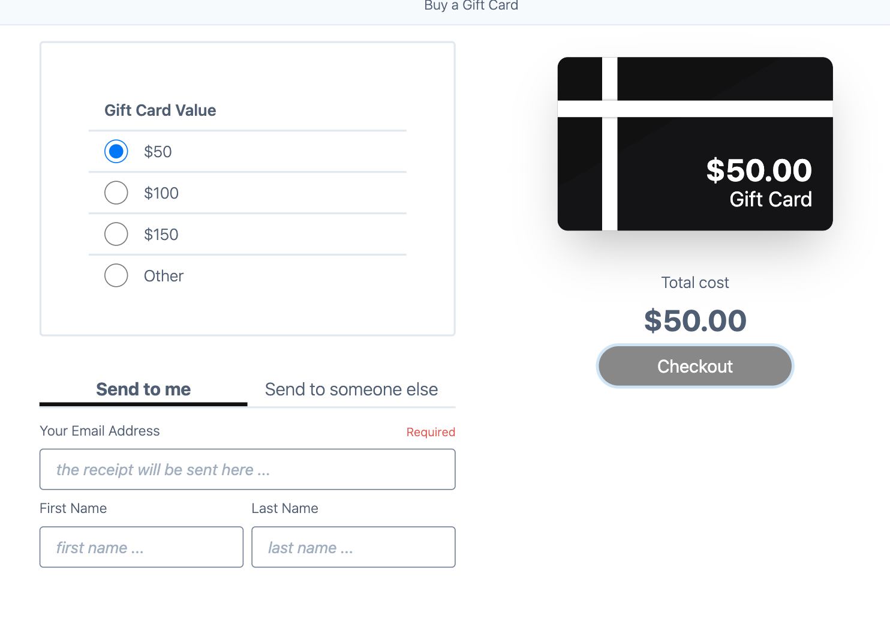
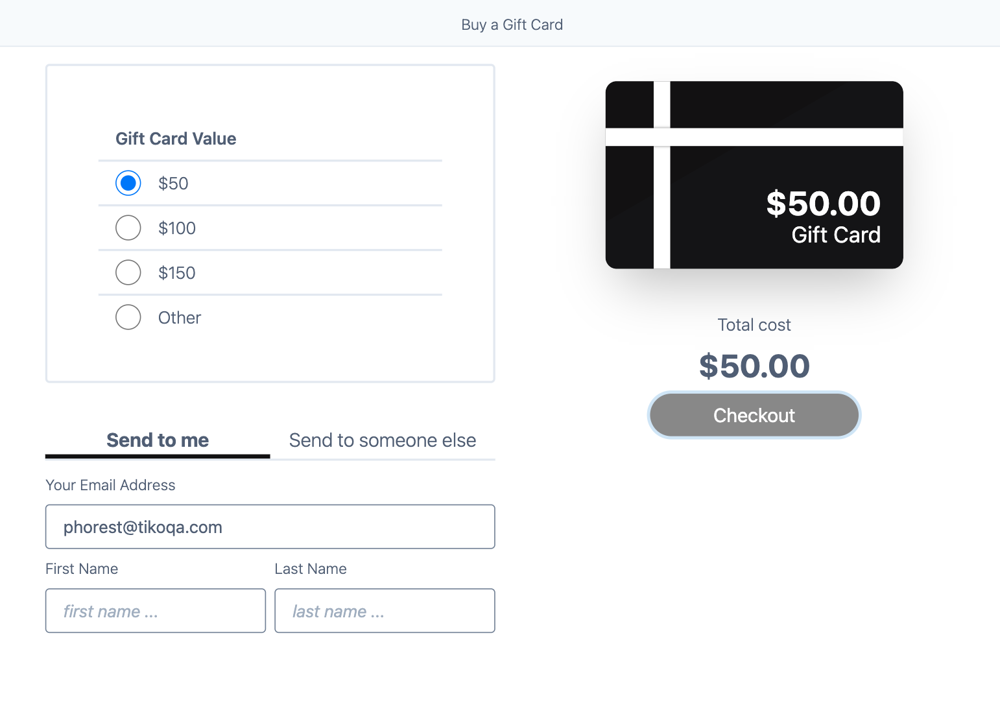

## How to run test on local
0. Make sure you have `node > 18` on the host machine

    If you have `nvm` simple run `nvm install` in the project directory

1. Install dependencies
```
npm install
```

2. Run tests
```
npm run test
```


## Bugs

1. First Name and Last Name fields are not displayed as required


Suggesting is to make **Checkout** button to be always clickable (do not set it into disabled state). So that, when clicked then invalid/incomplete fields would be highlighted for user attention.